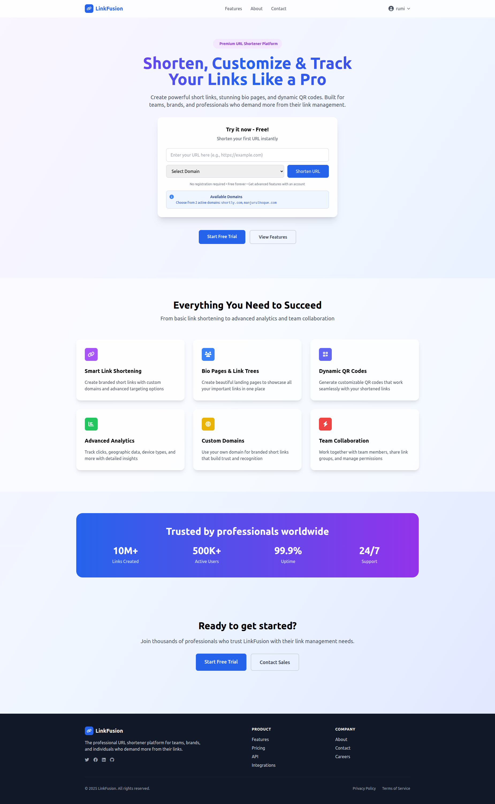
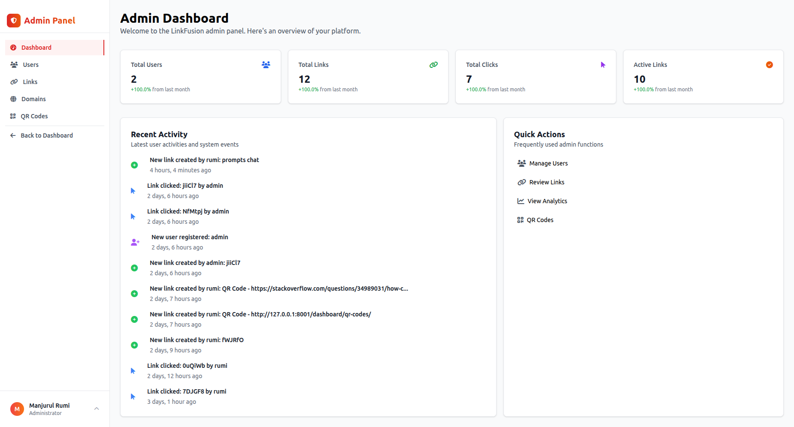
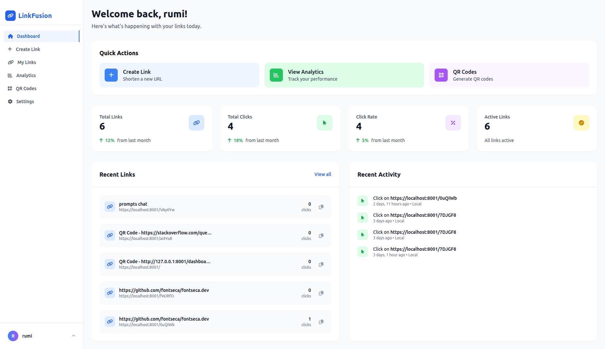
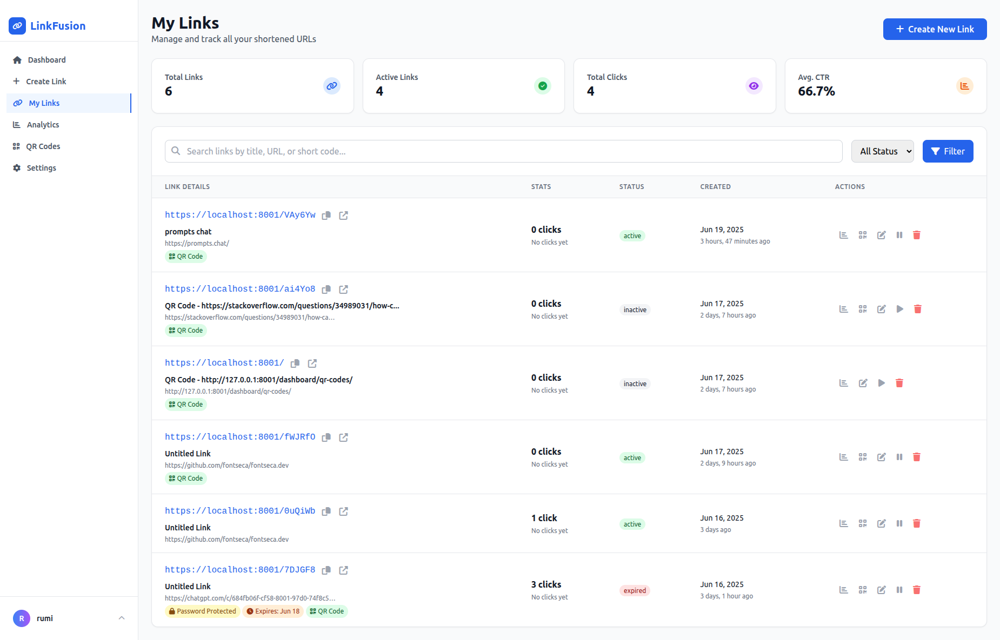
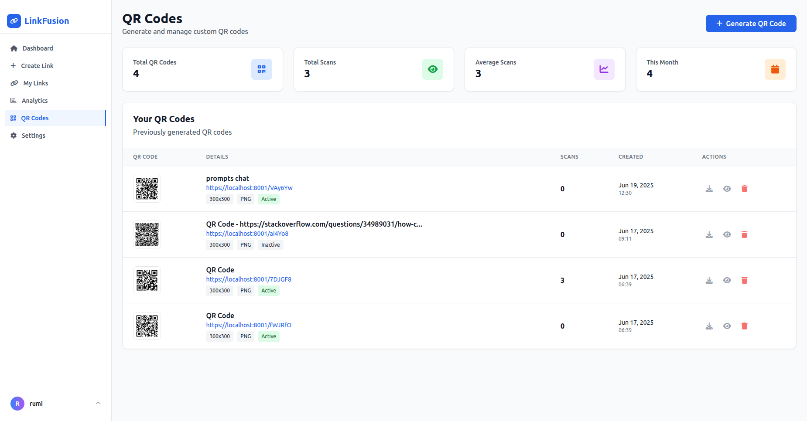
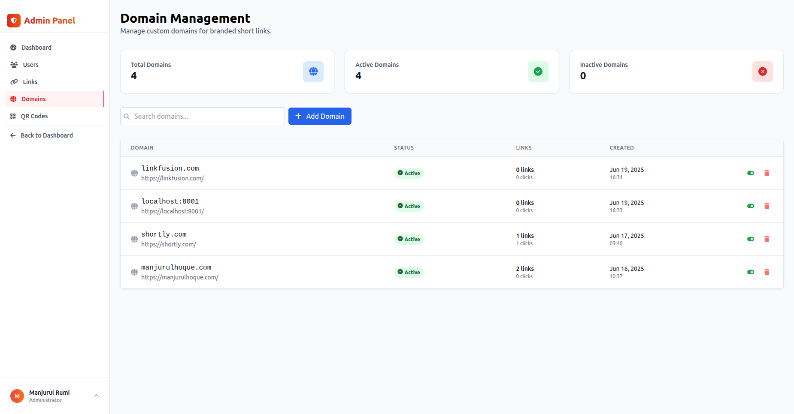

# LinkFusion - django URL shortener

A powerful and feature-rich Django app for URL shortening service with advanced analytics, QR code generation, and comprehensive admin management.



## 🚀 Features

### Core Features
- **URL Shortening**: Convert long URLs into short, manageable links
- **Custom Domains**: Support for branded short links with custom domains
- **Password Protection**: Secure links with password authentication
- **Link Expiration**: Set expiration dates and maximum click limits
- **QR Code Generation**: Automatic QR code creation for shortened URLs
- **Link Grouping**: Organize links into categories/folders

### Analytics & Tracking
- **Click Analytics**: Detailed click tracking with timestamps
- **Geographic Data**: Country and city-based analytics via IP geolocation
- **Device Analytics**: Browser, OS, and device type detection
- **User Agent Parsing**: Detailed browser and system information
- **Real-time Statistics**: Live dashboard with growth metrics

### User Management
- **User Authentication**: Secure login/registration system
- **User Profiles**: Extended user profiles with preferences
- **Notification Settings**: Configurable email and alert preferences

### Admin Panel
- **Admin Dashboard**: Comprehensive admin interface with statistics
- **User Management**: User suspension, activation, and deletion
- **Link Management**: Monitor and manage all shortened links
- **Domain Management**: Add and manage custom domains



## 🛠️ Tech Stack

### Backend Framework
- **Django 5.0+**: Modern Python web framework
- **SQLite**: Lightweight database for development
- **Django ORM**: Database abstraction layer

### Frontend Integration
- **Django Templates**: Server-side rendering
- **Tailwind CSS**: Utility-first CSS framework via django-tailwind
- **Alpine.js**: Lightweight JavaScript framework
- **FontAwesome**: Icon library

### External Libraries
- **Pillow**: Image processing for QR codes
- **qrcode**: QR code generation
- **user-agents**: User agent parsing
- **requests**: HTTP library for IP geolocation
- **python-decouple**: Environment variable management

### Development Tools
- **Django Admin**: Built-in admin interface
- **Django Debug Toolbar**: Development debugging (implied)
- **Hot Reload**: Live development server

## 📁 Project Structure

```
backend/
├── core/                    # Main application
│   ├── management/         # Custom Django commands
│   ├── migrations/         # Database migrations
│   ├── templatetags/       # Custom template tags
│   ├── admin.py           # Admin interface configuration
│   ├── apps.py            # App configuration
│   ├── forms.py           # Django forms (17KB)
│   ├── models.py          # Database models (12KB)
│   ├── urls.py            # URL routing (53 endpoints)
│   ├── utils.py           # Utility functions (8KB)
│   └── views.py           # View controllers (40KB)
├── users/                  # User authentication app
│   ├── migrations/
│   ├── admin.py
│   ├── models.py
│   ├── urls.py
│   └── views.py
├── link_fusion/           # Django project settings
│   ├── settings.py
│   ├── urls.py
│   └── wsgi.py
├── templates/             # HTML templates
│   ├── core/
│   │   ├── admin/         # Admin panel templates
│   │   └── dashboard/     # User dashboard templates
│   ├── users/
│   │   └── auth/          # Authentication templates
│   ├── admin_base.html
│   ├── base.html
│   └── dashboard_base.html
├── static/                # Static files
│   └── img/
├── media/                 # User uploaded files
├── theme/                 # Tailwind CSS theme
├── screenshots/           # Application screenshots
├── manage.py             # Django management script
└── requirements.txt      # Python dependencies
```

## 🗄️ Database Models

### Core Models
- **ShortenedURL**: Main model for shortened links with analytics
- **Click**: Individual click tracking with device/location data
- **Domain**: Custom domain management
- **UserProfile**: Extended user information and preferences
- **QRCode**: QR code generation and storage
- **LinkGroup**: Organize links into groups/folders // function not added yet

## 🔗 API Endpoints

### Public Pages
- `/` - Landing page
- `/about/` - About page
- `/features/` - Features showcase
- `/contact/` - Contact form

### Authentication
- `/login/` - User login
- `/register/` - User registration
- `/logout/` - User logout

### Dashboard (Protected)
- `/dashboard/` - User dashboard
- `/dashboard/create/` - Create new short link
- `/dashboard/links/` - Manage user links
- `/dashboard/analytics/` - Analytics dashboard
- `/dashboard/qr-codes/` - QR code management
- `/dashboard/settings/` - User settings



### Admin Panel (Staff Only)
- `/admin/` - Admin dashboard
- `/admin/users/` - User management
- `/admin/links/` - Link management
- `/admin/domains/` - Domain management

### API Endpoints
- `/api/shorten/` - URL shortening API
- `/api/links/<id>/toggle/` - Toggle link status
- `/api/links/<id>/delete/` - Delete link
- `/api/links/<id>/generate-qr/` - Generate QR code

### Link Redirection
- `/<short_code>/` - Redirect to original URL
- `/password/<short_code>/` - Password prompt for protected links

## 📊 Screenshots

### User Dashboard - My Links


### User Dashboard - QR Codes


### Admin Dashboard - Domains


## 💻 Development Setup

### Prerequisites
- Python 3.8+
- pip (Python package manager)
- Virtual environment (recommended)

### Installation

1. **Clone the repository**
   ```bash
   git clone https://github.com/manjurulhoque/link-fusion.git
   cd link-fusion/backend
   ```

2. **Create virtual environment**
   ```bash
   python -m venv venv
   source venv/bin/activate  # On Windows: venv\Scripts\activate
   ```

3. **Install dependencies**
   ```bash
   pip install -r requirements.txt
   ```

4. **Apply migrations**
   ```bash
   python manage.py makemigrations
   python manage.py migrate
   ```

5. **Create superuser (optional)**
   ```bash
   python manage.py createsuperuser
   ```

6. **Install Tailwind CSS**
   ```bash
   python manage.py tailwind install
   ```

7. **Run development server**
   ```bash
   python manage.py runserver
   ```

   Access the application at `http://localhost:8000`

8. **Run Tailwind CSS in watch mode (separate terminal)**
   ```bash
   python manage.py tailwind start
   ```

## 🔧 Configuration

### Custom Domains
Add custom domains through the admin panel or programmatically:
- Supports both regular domains (example.com) and localhost with ports (localhost:8001)
- Domain validation with proper regex patterns
- Active/inactive domain management

### QR Code Settings
- Configurable sizes (100x100 to 500x500)
- Error correction levels (L, M, Q, H)
- Custom colors for foreground and background
- Multiple export formats (PNG, SVG, JPG)

### Analytics Configuration
- IP geolocation via ipapi.co and ip-api.com
- User agent parsing with user-agents library
- Fallback parsing for better compatibility
- Country flag emojis and device icons

## 🚀 Production Deployment

### Database
- Configure PostgreSQL or MySQL for production
- Update `DATABASES` setting in `settings.py`
- Run migrations on production database

### Static Files
```bash
python manage.py collectstatic
```

### Security Settings
- Set `DEBUG = False`
- Configure `ALLOWED_HOSTS`
- Use environment variables for sensitive data
- Set up HTTPS and security headers

### Performance
- Enable database query optimization
- Configure caching (Redis/Memcached)
- Set up CDN for static files
- Monitor with application performance tools

## 📈 Analytics Features

### Click Tracking
- Real-time click counting
- Geographic distribution
- Device and browser analytics
- Time-based analytics with growth metrics

### Admin Analytics
- Platform-wide statistics
- User growth tracking
- Link creation trends
- Click performance metrics
- Recent activity feed

## 🔐 Security Features

- **Password Protection**: Individual link protection
- **CSRF Protection**: Django's built-in CSRF middleware
- **User Authentication**: Secure login/logout system
- **Admin Access Control**: Staff and superuser permissions
- **Input Validation**: Form validation and sanitization
- **SQL Injection Protection**: Django ORM protection

## 🎨 UI/UX Features

- **Responsive Design**: Mobile-first approach with Tailwind CSS
- **Modern Interface**: Clean and intuitive user interface
- **Interactive Elements**: Alpine.js for dynamic interactions
- **Loading States**: User feedback during operations
- **Error Handling**: Graceful error messages and fallbacks

## 🔄 Recent Updates

- Enhanced admin dashboard with real-time analytics
- Improved domain validation for localhost support
- Better user agent parsing with fallback options
- Responsive design improvements
- Advanced QR code customization options

## 📝 License

This project is licensed under the MIT License - see the LICENSE file for details.

## 🤝 Contributing

1. Fork the repository
2. Create your feature branch (`git checkout -b feature/AmazingFeature`)
3. Commit your changes (`git commit -m 'Add some AmazingFeature'`)
4. Push to the branch (`git push origin feature/AmazingFeature`)
5. Open a Pull Request

## 📞 Support

For support and questions:
- Create an issue in the GitHub repository
- Contact the development team
- Check the documentation for common solutions

---

**LinkFusion** - Powerful URL shortening with advanced analytics and management features. 